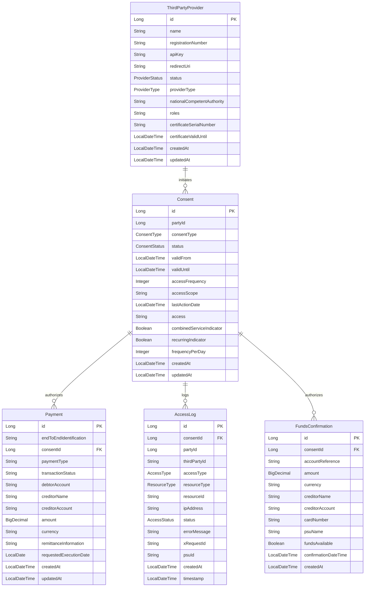

# Firefly Core Banking PSDX - PSD2/PSD3 Regulatory Compliance Service

[](LICENSE)

A comprehensive microservice for PSD2/PSD3 and FIDA regulatory compliance in banking applications. This service provides a centralized point for handling open banking requirements, enabling secure third-party access to account information and payment services. Part of the Firefly Core Banking ecosystem (github.org/firefly-oss).

## Table of Contents

- [Overview](#overview)
- [Understanding PSD2, PSD3, and FIDA](#understanding-psd2-psd3-and-fida)
- [Regulatory Compliance](#regulatory-compliance)
- [Quickstart Guide](#quickstart-guide)
- [Key Features](#key-features)
- [Architecture](#architecture)
- [Project Structure](#project-structure)
- [Data Model](#data-model)
- [Installation](#installation)
- [Configuration](#configuration)
- [Usage Examples](#usage-examples)
- [API Documentation](#api-documentation)
- [Security](#security)
- [Troubleshooting](#troubleshooting)
- [Monitoring and Observability](#monitoring-and-observability)
- [Contributing](#contributing)
- [License](#license)

## Overview

The Firefly Core Banking PSDX service implements the requirements of the Payment Services Directive 2 (PSD2) and its evolution PSD3, along with Financial Data Access (FIDA) regulations. It enables banks to provide secure APIs for third-party providers (TPPs) to access customer account information and initiate payments, with explicit customer consent and strong authentication.

This service acts as a gateway between TPPs and the core banking systems, ensuring regulatory compliance while protecting customer data and providing a seamless integration experience for partners.

## Understanding PSD2, PSD3, and FIDA

### Payment Services Directive 2 (PSD2)

PSD2 is a European Union directive that came into effect in January 2018, designed to regulate payment services and payment service providers throughout the EU and EEA. The key objectives of PSD2 include:

- **Enhancing Consumer Protection**: Strengthening security requirements for electronic payments and protecting consumers' financial data.
- **Promoting Innovation**: Opening the banking sector to new players (Third Party Providers) and fostering the development of new financial services.
- **Improving Security**: Introducing Strong Customer Authentication (SCA) requirements for electronic payments.
- **Reducing Costs**: Increasing competition in the payment services market to drive down costs.

PSD2 introduced two new types of regulated service providers:

1. **Account Information Service Providers (AISPs)**: Entities that can access account information from multiple banks on behalf of customers.
2. **Payment Initiation Service Providers (PISPs)**: Entities that can initiate payments directly from a customer's bank account on their behalf.

### Payment Services Directive 3 (PSD3)

PSD3 is the anticipated evolution of PSD2, expected to address limitations and challenges identified in PSD2 implementation. While not yet finalized, PSD3 is expected to focus on:

- **Enhanced API Standardization**: Moving beyond the minimum requirements of PSD2 to create more standardized, feature-rich APIs.
- **Expanded Scope**: Including additional financial services and payment types not covered by PSD2.
- **Improved User Experience**: Streamlining customer journeys and reducing friction in authentication processes.
- **Premium API Services**: Enabling banks to offer value-added services beyond the regulatory minimum requirements.
- **Data Sharing Enhancements**: Expanding the types of financial data that can be shared with third parties.
- **Global Interoperability**: Facilitating better alignment with open banking initiatives in other regions.

### Financial Data Access (FIDA)

FIDA represents the broader concept of secure, consent-based access to financial data beyond the scope of PSD2. Key aspects include:

- **Comprehensive Data Access**: Extending beyond payment accounts to include investment accounts, loans, insurance, and other financial products.
- **Global Approach**: Addressing financial data access across different regulatory regimes and jurisdictions.
- **Consent Management**: Sophisticated mechanisms for customers to grant, monitor, and revoke access to their financial data.
- **Data Standardization**: Common formats and taxonomies for financial data to enable interoperability.
- **Privacy by Design**: Built-in safeguards to protect sensitive financial information while enabling innovation.
- **Cross-Sector Integration**: Enabling financial data to be used in conjunction with other sectors (healthcare, telecommunications, etc.).

## Regulatory Compliance

The Firefly Core Banking PSDX service ensures compliance with PSD2, PSD3, and FIDA regulations through the following mechanisms:

### PSD2 Compliance

- **Strong Customer Authentication (SCA)**: Implements multi-factor authentication for payment initiation and account access.
- **Secure Communication**: Uses TLS 1.2+ for all API communications with proper certificate validation.
- **Consent Management**: Comprehensive system for obtaining, storing, and validating customer consents.
- **TPP Verification**: Validates the identity and authorization of Third Party Providers before granting access.
- **Transaction Risk Analysis**: Implements risk-based authentication exemptions where permitted by regulations.
- **Fraud Monitoring**: Continuous monitoring of transactions for suspicious patterns.
- **Regulatory Reporting**: Automated generation of required regulatory reports.

### PSD3 Readiness

- **Premium API Services**: Architecture designed to support value-added services beyond regulatory requirements.
- **Flexible API Framework**: Adaptable API design that can evolve with changing regulatory requirements.
- **Enhanced Data Sharing**: Support for expanded data types and enriched data formats.
- **Advanced Consent Models**: Sophisticated consent management supporting variable scopes and durations.
- **Cross-Border Capabilities**: Support for international payment initiation and account information services.

### FIDA Implementation

- **Comprehensive Data Access**: APIs for accessing a wide range of financial products and services.
- **Fine-Grained Permissions**: Detailed control over which data elements can be accessed by third parties.
- **Audit Trails**: Complete logging of all data access for compliance and customer transparency.
- **Data Minimization**: Implementation of data minimization principles to limit exposure of sensitive information.
- **Privacy Controls**: Advanced privacy features including data masking and tokenization.

## Quickstart Guide

Get started with the Firefly Core Banking PSDX service in your Firefly Core Banking environment:

### Prerequisites

- Firefly Core Banking Platform v2.5+
- Java 21 or higher
- PostgreSQL 14 or higher
- Docker and Docker Compose (for containerized deployment)

### Integration with Firefly Core Banking

1. **Add the PSDX Service to Your Firefly Environment**:

   ```bash
   # Clone the repository into your Firefly workspace
   git clone https://github.com/firefly-oss/core-banking-psdx.git
   cd core-banking-psdx
   ```

2. **Configure Core Banking Integration**:

   Edit `application.yml` to connect to your Firefly Core Banking services:

   ```yaml
   firefly:
     core-banking:
       account-service-url: http://account-service:8080
       customer-service-url: http://customer-service:8080
       payment-service-url: http://payment-service:8080
       auth-service-url: http://auth-service:8080
   ```

3. **Set Up Database**:

   ```bash
   # Create the database
   firefly db create --name psdx

   # Run migrations
   firefly db migrate --service psdx
   ```

4. **Start the Service**:

   ```bash
   # Start as a standalone service
   firefly service start --name psdx

   # Or with the entire Firefly platform
   firefly platform start
   ```

5. **Verify Installation**:

   ```bash
   # Check service health
   curl http://localhost:8080/actuator/health

   # View API documentation
   curl http://localhost:8080/v3/api-docs
   ```

### Quick Configuration

1. **Enable TPP Registration**:

   ```yaml
   spring:
     application:
       name: core-banking-psdx

   psdx:
     tpp:
       registration:
         enabled: true
         requires-approval: true
         notification-email: openbanking@yourbank.com
   ```

2. **Configure SCA Methods**:

   ```yaml
   psdx:
     sca:
       methods:
         - type: SMS
           enabled: true
           timeout-seconds: 300
         - type: APP_NOTIFICATION
           enabled: true
           timeout-seconds: 180
   ```

3. **Configure Consent Settings**:

   ```yaml
   psdx:
     consent:
       max-validity-days:
         account-information: 90
         payment-initiation: 1
       require-sca-renewal-days: 30
   ```


## Key Features

- **Consent Management**: Create, retrieve, update, and revoke customer consents for data access and payment initiation
- **Strong Customer Authentication (SCA)**: Implement multi-factor authentication for secure access
- **Third Party Provider (TPP) Management**: Register, validate, and manage TPPs and their access rights
- **Account Information Services (AIS)**: Provide secure access to account details, balances, and transaction history
- **Payment Initiation Services (PIS)**: Enable secure payment initiation by authorized TPPs
- **Funds Confirmation**: Verify availability of funds for transactions
- **Access Logging and Audit Trail**: Comprehensive logging of all API access for regulatory compliance
- **Card Account Services**: Support for card-based payment instruments
- **Reactive Programming Model**: Built with Spring WebFlux for high performance and scalability

## Architecture

The Firefly Core Banking PSDX service follows a modular, microservice-based architecture with the following components:

```
┌─────────────────┐     ┌─────────────────┐     ┌─────────────────┐
│                 │     │                 │     │                 │
│  Third Party    │     │  Firefly Core   │     │  Firefly Core   │
│  Providers      │◄────►  Banking PSDX   │◄────►  Banking        │
│  (TPPs)         │     │                 │     │                 │
│                 │     │                 │     │                 │
└─────────────────┘     └────────┬────────┘     └─────────────────┘
                                 │
                                 │
                        ┌────────▼────────┐
                        │                 │
                        │  Database       │
                        │                 │
                        └─────────────────┘
```

- **Reactive API Layer**: Spring WebFlux-based REST APIs for high throughput and non-blocking I/O
- **Service Layer**: Business logic implementation with transaction management
- **Data Access Layer**: Reactive database access using R2DBC
- **Security Layer**: Authentication, authorization, and consent validation
- **Logging and Monitoring**: Comprehensive audit logging for regulatory compliance

## Project Structure

The project is organized into multiple modules:

- **core-banking-psdx-interfaces**: API contracts, DTOs, and service interfaces
- **core-banking-psdx-models**: Data models and repository interfaces
- **core-banking-psdx-core**: Core business logic and service implementations
- **core-banking-psdx-web**: REST controllers, security configuration, and web layer

## Data Model



## Installation

### Prerequisites

- Java 21 or higher
- Maven 3.8 or higher
- PostgreSQL 14 or higher (with R2DBC support)

### Building from Source

1. Clone the repository:
   ```bash
   git clone https://github.com/firefly-oss/core-banking-psdx.git
   cd core-banking-psdx
   ```

2. Build the project:
   ```bash
   mvn clean install
   ```

3. Run the application:
   ```bash
   java -jar core-banking-psdx-web/target/core-banking-psdx-web.jar
   ```

### Docker Deployment

1. Build the Docker image:
   ```bash
   mvn clean package
   docker build -t core-banking-psdx .
   ```

2. Run the container:
   ```bash
   docker run -p 8080:8080 core-banking-psdx
   ```

## Configuration

The application can be configured using standard Spring Boot configuration mechanisms. Key configuration properties include:

### Database Configuration

```properties
spring.r2dbc.url=r2dbc:postgresql://localhost:5432/psdx
spring.r2dbc.username=postgres
spring.r2dbc.password=postgres
```

### Security Configuration

```properties
psdx.security.api-key-header=X-API-KEY
psdx.security.consent-id-header=X-Consent-ID
psdx.security.jwt.secret=your-secret-key
psdx.security.jwt.expiration=86400
```

### Logging Configuration

```properties
logging.level.com.catalis.core.banking.psdx=INFO
logging.level.org.springframework.web=INFO
logging.level.org.springframework.data.r2dbc=INFO
```

## Usage Examples

This section provides detailed examples of common API flows for the Firefly Core Banking PSDX service.

### TPP Registration Flow

The TPP Registration flow allows Third Party Providers to register with the bank and obtain the necessary credentials to access the APIs.

1. **Register a Third Party Provider**:

   This request registers a new TPP in the system with their details and roles.

   ```bash
   curl -X POST http://localhost:8080/api/v1/providers \
     -H "Content-Type: application/json" \
     -d '{
       "name": "Example Fintech",
       "registrationNumber": "FIN12345",
       "redirectUri": "https://example-fintech.com/callback",
       "providerType": "AISP",
       "nationalCompetentAuthority": "Financial Conduct Authority",
       "nationalCompetentAuthorityCountry": "GB",
       "roles": ["AISP", "PISP"],
       "certificateSubject": "CN=Example Fintech,O=Example,C=GB"
     }'
   ```

   Response:
   ```json
   {
     "id": 1,
     "name": "Example Fintech",
     "registrationNumber": "FIN12345",
     "nationalCompetentAuthority": "Financial Conduct Authority",
     "nationalCompetentAuthorityCountry": "GB",
     "redirectUri": "https://example-fintech.com/callback",
     "status": "REGISTERED",
     "providerType": "AISP",
     "roles": ["AISP", "PISP"],
     "certificate": {
       "serialNumber": "12345678",
       "subject": "CN=Example Fintech,O=Example,C=GB",
       "issuer": "CN=PSD2 CA,O=European Banking Authority,C=EU",
       "validFrom": "2023-01-01T00:00:00",
       "validUntil": "2024-01-01T00:00:00"
     },
     "_links": {
       "self": {"href": "/api/v1/providers/1"},
       "activate": {"href": "/api/v1/providers/1/activate"},
       "suspend": {"href": "/api/v1/providers/1/suspend"}
     },
     "createdAt": "2023-01-15T10:30:00",
     "updatedAt": "2023-01-15T10:30:00"
   }
   ```

2. **Activate the TPP**:

   After verification, the TPP needs to be activated to allow API access.

   ```bash
   curl -X POST http://localhost:8080/api/v1/providers/1/activate
   ```

   Response:
   ```json
   {
     "id": 1,
     "name": "Example Fintech",
     "registrationNumber": "FIN12345",
     "nationalCompetentAuthority": "Financial Conduct Authority",
     "nationalCompetentAuthorityCountry": "GB",
     "redirectUri": "https://example-fintech.com/callback",
     "status": "ACTIVE",
     "providerType": "AISP",
     "roles": ["AISP", "PISP"],
     "certificate": {
       "serialNumber": "12345678",
       "subject": "CN=Example Fintech,O=Example,C=GB",
       "issuer": "CN=PSD2 CA,O=European Banking Authority,C=EU",
       "validFrom": "2023-01-01T00:00:00",
       "validUntil": "2024-01-01T00:00:00"
     },
     "_links": {
       "self": {"href": "/api/v1/providers/1"},
       "suspend": {"href": "/api/v1/providers/1/suspend"}
     },
     "createdAt": "2023-01-15T10:30:00",
     "updatedAt": "2023-01-15T10:35:00"
   }
   ```

3. **Validate TPP API Key**:

   TPPs can validate their API key to ensure it's active and working.

   ```bash
   curl -X GET http://localhost:8080/api/v1/providers/validate \
     -H "X-API-KEY: tpp-api-key-12345"
   ```

   Response:
   ```json
   {
     "id": 1,
     "name": "Example Fintech",
     "registrationNumber": "FIN12345",
     "nationalCompetentAuthority": "Financial Conduct Authority",
     "nationalCompetentAuthorityCountry": "GB",
     "redirectUri": "https://example-fintech.com/callback",
     "status": "ACTIVE",
     "providerType": "AISP",
     "roles": ["AISP", "PISP"],
     "certificate": {
       "serialNumber": "12345678",
       "subject": "CN=Example Fintech,O=Example,C=GB",
       "issuer": "CN=PSD2 CA,O=European Banking Authority,C=EU",
       "validFrom": "2023-01-01T00:00:00",
       "validUntil": "2024-01-01T00:00:00"
     },
     "_links": {
       "self": {"href": "/api/v1/providers/1"},
       "suspend": {"href": "/api/v1/providers/1/suspend"}
     },
     "createdAt": "2023-01-15T10:30:00",
     "updatedAt": "2023-01-15T10:35:00"
   }
   ```

### Consent Management Flow

The Consent Management flow allows TPPs to request and manage customer consents for accessing their data.

1. **Create a Consent**:

   This request creates a new consent for accessing customer data.

   ```bash
   curl -X POST http://localhost:8080/api/v1/consents \
     -H "Content-Type: application/json" \
     -H "X-API-KEY: tpp-api-key-12345" \
     -d '{
       "partyId": 12345,
       "consentType": "ACCOUNT_INFORMATION",
       "validUntil": "2023-12-31T23:59:59",
       "accessFrequency": 4,
       "accessScope": "accounts,balances,transactions",
       "recurringIndicator": true,
       "frequencyPerDay": 4
     }'
   ```

   Response:
   ```json
   {
     "id": 1,
     "partyId": 12345,
     "consentType": "account",
     "consentStatus": "RECEIVED",
     "validFrom": "2023-01-15T10:35:00",
     "validUntil": "2023-12-31T23:59:59",
     "frequencyPerDay": 4,
     "accessFrequency": 4,
     "accessScope": "accounts,balances,transactions",
     "access": [
       {
         "type": "account",
         "availableAccounts": "allAccounts"
       },
       {
         "type": "balance",
         "availableAccounts": "allAccounts"
       },
       {
         "type": "transaction",
         "availableAccounts": "allAccounts"
       }
     ],
     "combinedServiceIndicator": false,
     "recurringIndicator": true,
     "_links": {
       "self": {"href": "/api/v1/consents/1"},
       "status": {"href": "/api/v1/consents/1/status"},
       "scaRedirect": {"href": "/api/v1/sca/redirect/consent/1"}
     },
     "createdAt": "2023-01-15T10:35:00",
     "updatedAt": "2023-01-15T10:35:00"
   }
   ```

2. **Update Consent Status** (after customer authentication):

   After the customer completes SCA, the consent status is updated to VALID.

   ```bash
   curl -X PUT http://localhost:8080/api/v1/consents/1/status \
     -H "Content-Type: application/json" \
     -H "X-API-KEY: tpp-api-key-12345" \
     -d '{
       "status": "VALID"
     }'
   ```

   Response:
   ```json
   {
     "id": 1,
     "partyId": 12345,
     "consentType": "account",
     "consentStatus": "VALID",
     "validFrom": "2023-01-15T10:35:00",
     "validUntil": "2023-12-31T23:59:59",
     "frequencyPerDay": 4,
     "accessFrequency": 4,
     "accessScope": "accounts,balances,transactions",
     "lastActionDate": "2023-01-15T10:40:00",
     "access": [
       {
         "type": "account",
         "availableAccounts": "allAccounts"
       },
       {
         "type": "balance",
         "availableAccounts": "allAccounts"
       },
       {
         "type": "transaction",
         "availableAccounts": "allAccounts"
       }
     ],
     "combinedServiceIndicator": false,
     "recurringIndicator": true,
     "_links": {
       "self": {"href": "/api/v1/consents/1"},
       "status": {"href": "/api/v1/consents/1/status"}
     },
     "createdAt": "2023-01-15T10:35:00",
     "updatedAt": "2023-01-15T10:40:00"
   }
   ```

3. **Get Consent Details**:

   TPPs can retrieve the details of an existing consent.

   ```bash
   curl -X GET http://localhost:8080/api/v1/consents/1 \
     -H "X-API-KEY: tpp-api-key-12345"
   ```

   Response:
   ```json
   {
     "id": 1,
     "partyId": 12345,
     "consentType": "account",
     "consentStatus": "VALID",
     "validFrom": "2023-01-15T10:35:00",
     "validUntil": "2023-12-31T23:59:59",
     "frequencyPerDay": 4,
     "accessFrequency": 4,
     "accessScope": "accounts,balances,transactions",
     "lastActionDate": "2023-01-15T10:40:00",
     "access": [
       {
         "type": "account",
         "availableAccounts": "allAccounts"
       },
       {
         "type": "balance",
         "availableAccounts": "allAccounts"
       },
       {
         "type": "transaction",
         "availableAccounts": "allAccounts"
       }
     ],
     "combinedServiceIndicator": false,
     "recurringIndicator": true,
     "_links": {
       "self": {"href": "/api/v1/consents/1"},
       "status": {"href": "/api/v1/consents/1/status"}
     },
     "createdAt": "2023-01-15T10:35:00",
     "updatedAt": "2023-01-15T10:40:00"
   }
   ```

4. **Revoke a Consent**:

   TPPs or customers can revoke a consent at any time.

   ```bash
   curl -X DELETE http://localhost:8080/api/v1/consents/1 \
     -H "X-API-KEY: tpp-api-key-12345"
   ```

   Response:
   ```json
   {
     "id": 1,
     "partyId": 12345,
     "consentType": "account",
     "consentStatus": "REVOKED",
     "validFrom": "2023-01-15T10:35:00",
     "validUntil": "2023-12-31T23:59:59",
     "frequencyPerDay": 4,
     "accessFrequency": 4,
     "accessScope": "accounts,balances,transactions",
     "lastActionDate": "2023-01-15T11:20:00",
     "access": [
       {
         "type": "account",
         "availableAccounts": "allAccounts"
       },
       {
         "type": "balance",
         "availableAccounts": "allAccounts"
       },
       {
         "type": "transaction",
         "availableAccounts": "allAccounts"
       }
     ],
     "combinedServiceIndicator": false,
     "recurringIndicator": true,
     "_links": {
       "self": {"href": "/api/v1/consents/1"}
     },
     "createdAt": "2023-01-15T10:35:00",
     "updatedAt": "2023-01-15T11:20:00"
   }
   ```

### Account Information Flow

The Account Information flow allows TPPs to access customer account information after obtaining consent.

1. **Get Customer Accounts**:

   Retrieve all accounts owned by a customer.

   ```bash
   curl -X GET http://localhost:8080/api/v1/accounts?partyId=12345 \
     -H "X-API-KEY: tpp-api-key-12345" \
     -H "X-Consent-ID: 1"
   ```

   Response:
   ```json
   [
     {
       "id": 789,
       "resourceId": "account-789",
       "iban": "GB29NWBK60161331926819",
       "currency": "GBP",
       "name": "Main Account",
       "product": "Current Account",
       "status": "enabled",
       "_links": {
         "balances": {"href": "/api/v1/accounts/789/balances"},
         "transactions": {"href": "/api/v1/accounts/789/transactions"}
       }
     },
     {
       "id": 790,
       "resourceId": "account-790",
       "iban": "GB29NWBK60161331926820",
       "currency": "EUR",
       "name": "Euro Account",
       "product": "Savings Account",
       "status": "enabled",
       "_links": {
         "balances": {"href": "/api/v1/accounts/790/balances"},
         "transactions": {"href": "/api/v1/accounts/790/transactions"}
       }
     }
   ]
   ```

2. **Get Account Balances**:

   Retrieve the balances for a specific account.

   ```bash
   curl -X GET http://localhost:8080/api/v1/accounts/789/balances \
     -H "X-API-KEY: tpp-api-key-12345" \
     -H "X-Consent-ID: 1"
   ```

   Response:
   ```json
   [
     {
       "balanceType": "closingBooked",
       "amount": 1250.00,
       "currency": "GBP",
       "referenceDate": "2023-01-14"
     },
     {
       "balanceType": "expected",
       "amount": 1230.50,
       "currency": "GBP",
       "referenceDate": "2023-01-15"
     },
     {
       "balanceType": "available",
       "amount": 1230.50,
       "currency": "GBP",
       "referenceDate": "2023-01-15"
     }
   ]
   ```

3. **Get Account Transactions**:

   Retrieve transactions for a specific account within a date range.

   ```bash
   curl -X GET "http://localhost:8080/api/v1/accounts/789/transactions?fromDate=2023-01-01&toDate=2023-01-31" \
     -H "X-API-KEY: tpp-api-key-12345" \
     -H "X-Consent-ID: 1"
   ```

   Response:
   ```json
   [
     {
       "transactionId": "tx-001",
       "bookingDate": "2023-01-10",
       "valueDate": "2023-01-10",
       "amount": -82.50,
       "currency": "GBP",
       "creditorName": "Grocery Store",
       "remittanceInformationUnstructured": "Weekly shopping"
     },
     {
       "transactionId": "tx-002",
       "bookingDate": "2023-01-15",
       "valueDate": "2023-01-15",
       "amount": 1500.00,
       "currency": "GBP",
       "debtorName": "Employer Ltd",
       "remittanceInformationUnstructured": "Salary payment"
     }
   ]
   ```

### Payment Initiation Flow

The Payment Initiation flow allows TPPs to initiate payments on behalf of customers after obtaining consent.

1. **Initiate a Payment**:

   Create a new payment on behalf of a customer.

   ```bash
   curl -X POST http://localhost:8080/api/v1/payments \
     -H "Content-Type: application/json" \
     -H "X-API-KEY: tpp-api-key-12345" \
     -H "X-Consent-ID: 2" \
     -d '{
       "endToEndIdentification": "E2E-12345",
       "debtorAccount": "GB29NWBK60161331926819",
       "creditorName": "John Doe",
       "creditorAccount": "GB29NWBK60161331926820",
       "amount": 100.00,
       "currency": "GBP",
       "remittanceInformationUnstructured": "Invoice payment #123",
       "requestedExecutionDate": "2023-02-01"
     }'
   ```

   Response:
   ```json
   {
     "paymentId": 1,
     "endToEndIdentification": "E2E-12345",
     "consentId": 2,
     "paymentType": "sepa-credit-transfers",
     "transactionStatus": "RCVD",
     "debtorAccount": {
       "iban": "GB29NWBK60161331926819",
       "currency": "GBP"
     },
     "creditorName": "John Doe",
     "creditorAccount": {
       "iban": "GB29NWBK60161331926820",
       "currency": "GBP"
     },
     "instructedAmount": {
       "currency": "GBP",
       "amount": 100.00
     },
     "remittanceInformationUnstructured": "Invoice payment #123",
     "requestedExecutionDate": "2023-02-01",
     "_links": {
       "self": {"href": "/api/v1/payments/1"},
       "status": {"href": "/api/v1/payments/1/status"},
       "scaRedirect": {"href": "/api/v1/sca/redirect/payment/1"}
     },
     "createdAt": "2023-01-15T14:20:00",
     "updatedAt": "2023-01-15T14:20:00"
   }
   ```

2. **Authorize the Payment** (after SCA):

   After the customer completes SCA, the payment is authorized.

   ```bash
   curl -X POST http://localhost:8080/api/v1/payments/1/authorize \
     -H "Content-Type: application/json" \
     -H "X-API-KEY: tpp-api-key-12345" \
     -H "X-Consent-ID: 2" \
     -d '"auth-code-from-sca"'
   ```

   Response:
   ```json
   {
     "paymentId": 1,
     "endToEndIdentification": "E2E-12345",
     "consentId": 2,
     "paymentType": "sepa-credit-transfers",
     "transactionStatus": "ACCP",
     "debtorAccount": {
       "iban": "GB29NWBK60161331926819",
       "currency": "GBP"
     },
     "creditorName": "John Doe",
     "creditorAccount": {
       "iban": "GB29NWBK60161331926820",
       "currency": "GBP"
     },
     "instructedAmount": {
       "currency": "GBP",
       "amount": 100.00
     },
     "remittanceInformationUnstructured": "Invoice payment #123",
     "requestedExecutionDate": "2023-02-01",
     "_links": {
       "self": {"href": "/api/v1/payments/1"},
       "status": {"href": "/api/v1/payments/1/status"}
     },
     "createdAt": "2023-01-15T14:20:00",
     "updatedAt": "2023-01-15T14:25:00"
   }
   ```

3. **Check Payment Status**:

   TPPs can check the status of a payment at any time.

   ```bash
   curl -X GET http://localhost:8080/api/v1/payments/1/status \
     -H "X-API-KEY: tpp-api-key-12345" \
     -H "X-Consent-ID: 2"
   ```

   Response:
   ```json
   {
     "paymentId": 1,
     "transactionStatus": "ACSP",
     "fundsAvailable": true,
     "statusChangeDateTime": "2023-01-15T14:30:00",
     "_links": {
       "self": {"href": "/api/v1/payments/1/status"}
     }
   }
   ```

4. **Cancel a Payment**:

   TPPs can cancel a payment that hasn't been executed yet.

   ```bash
   curl -X DELETE http://localhost:8080/api/v1/payments/1 \
     -H "X-API-KEY: tpp-api-key-12345" \
     -H "X-Consent-ID: 2"
   ```

   Response:
   ```json
   {
     "paymentId": 1,
     "endToEndIdentification": "E2E-12345",
     "consentId": 2,
     "paymentType": "sepa-credit-transfers",
     "transactionStatus": "CANC",
     "debtorAccount": {
       "iban": "GB29NWBK60161331926819",
       "currency": "GBP"
     },
     "creditorName": "John Doe",
     "creditorAccount": {
       "iban": "GB29NWBK60161331926820",
       "currency": "GBP"
     },
     "instructedAmount": {
       "currency": "GBP",
       "amount": 100.00
     },
     "remittanceInformationUnstructured": "Invoice payment #123",
     "requestedExecutionDate": "2023-02-01",
     "_links": {
       "self": {"href": "/api/v1/payments/1"}
     },
     "createdAt": "2023-01-15T14:20:00",
     "updatedAt": "2023-01-15T14:35:00"
   }
   ```

### Card Account Information Flow

The Card Account Information flow allows TPPs to access customer card account information after obtaining consent.

1. **Get Customer Card Accounts**:

   Retrieve all card accounts owned by a customer.

   ```bash
   curl -X GET http://localhost:8080/api/v1/card-accounts?partyId=12345 \
     -H "X-API-KEY: tpp-api-key-12345" \
     -H "X-Consent-ID: 1"
   ```

   Response:
   ```json
   [
     {
       "id": 456,
       "resourceId": "card-456",
       "maskedPan": "123456xxxxxx7890",
       "currency": "GBP",
       "name": "Gold Credit Card",
       "product": "Credit Card",
       "status": "enabled",
       "creditLimit": 5000.00,
       "cardholderName": "Jane Smith",
       "expiryDate": "2025-12",
       "_links": {
         "balances": {"href": "/api/v1/card-accounts/456/balances"},
         "transactions": {"href": "/api/v1/card-accounts/456/transactions"}
       }
     },
     {
       "id": 457,
       "resourceId": "card-457",
       "maskedPan": "987654xxxxxx1234",
       "currency": "EUR",
       "name": "Travel Debit Card",
       "product": "Debit Card",
       "status": "enabled",
       "cardholderName": "Jane Smith",
       "expiryDate": "2024-06",
       "_links": {
         "balances": {"href": "/api/v1/card-accounts/457/balances"},
         "transactions": {"href": "/api/v1/card-accounts/457/transactions"}
       }
     }
   ]
   ```

2. **Get Card Account Balances**:

   Retrieve the balances for a specific card account.

   ```bash
   curl -X GET http://localhost:8080/api/v1/card-accounts/456/balances \
     -H "X-API-KEY: tpp-api-key-12345" \
     -H "X-Consent-ID: 1"
   ```

   Response:
   ```json
   [
     {
       "balanceType": "authorised",
       "amount": 1250.00,
       "currency": "GBP",
       "referenceDate": "2023-01-15"
     },
     {
       "balanceType": "expected",
       "amount": 1350.00,
       "currency": "GBP",
       "referenceDate": "2023-01-15"
     },
     {
       "balanceType": "available",
       "amount": 3750.00,
       "currency": "GBP",
       "referenceDate": "2023-01-15"
     }
   ]
   ```

3. **Get Card Account Transactions**:

   Retrieve transactions for a specific card account within a date range.

   ```bash
   curl -X GET "http://localhost:8080/api/v1/card-accounts/456/transactions?fromDate=2023-01-01&toDate=2023-01-31" \
     -H "X-API-KEY: tpp-api-key-12345" \
     -H "X-Consent-ID: 1"
   ```

   Response:
   ```json
   [
     {
       "transactionId": "ctx-001",
       "bookingDate": "2023-01-12",
       "valueDate": "2023-01-12",
       "amount": -125.50,
       "currency": "GBP",
       "creditorName": "Electronics Store",
       "remittanceInformationUnstructured": "Electronics purchase",
       "cardAcceptorName": "Electronics Store Ltd",
       "cardAcceptorCity": "London",
       "merchantCategoryCode": "5732"
     },
     {
       "transactionId": "ctx-002",
       "bookingDate": "2023-01-14",
       "valueDate": "2023-01-14",
       "amount": -45.00,
       "currency": "GBP",
       "creditorName": "Restaurant",
       "remittanceInformationUnstructured": "Dinner",
       "cardAcceptorName": "Fine Dining Ltd",
       "cardAcceptorCity": "London",
       "merchantCategoryCode": "5812"
     }
   ]
   ```

### Funds Confirmation Flow

The Funds Confirmation flow allows TPPs to check if sufficient funds are available for a transaction.

1. **Confirm Funds Availability**:

   Check if sufficient funds are available for a transaction.

   ```bash
   curl -X POST http://localhost:8080/api/v1/funds-confirmations \
     -H "Content-Type: application/json" \
     -H "X-API-KEY: tpp-api-key-12345" \
     -H "X-Consent-ID: 3" \
     -d '{
       "accountReference": "GB29NWBK60161331926819",
       "amount": 50.00,
       "currency": "GBP",
       "cardNumber": "1234567890123456"
     }'
   ```

   Response:
   ```json
   {
     "id": 1,
     "fundsAvailable": true,
     "accountReference": "GB29NWBK60161331926819",
     "amount": 50.00,
     "currency": "GBP",
     "cardNumber": "123456xxxxxx3456",
     "psuName": "Jane Smith",
     "confirmationDateTime": "2023-01-15T15:45:00",
     "_links": {
       "self": {"href": "/api/v1/funds-confirmations/1"}
     }
   }
   ```

2. **Retrieve a Previous Funds Confirmation**:

   Retrieve the details of a previous funds confirmation.

   ```bash
   curl -X GET http://localhost:8080/api/v1/funds-confirmations/1 \
     -H "X-API-KEY: tpp-api-key-12345" \
     -H "X-Consent-ID: 3"
   ```

   Response:
   ```json
   {
     "id": 1,
     "fundsAvailable": true,
     "accountReference": "GB29NWBK60161331926819",
     "amount": 50.00,
     "currency": "GBP",
     "cardNumber": "123456xxxxxx3456",
     "psuName": "Jane Smith",
     "confirmationDateTime": "2023-01-15T15:45:00",
     "_links": {
       "self": {"href": "/api/v1/funds-confirmations/1"}
     }
   }
   ```

## API Documentation

The Firefly Core Banking PSDX service provides a comprehensive set of RESTful APIs for PSD2/PSD3 and FIDA compliance. The API is organized into several functional areas, each addressing specific regulatory requirements.

### API Documentation Access

The complete API documentation is available through Swagger UI when the application is running:

```
http://localhost:8080/swagger-ui.html
```

The OpenAPI specification is also available at:

```
http://localhost:8080/v3/api-docs
```

### API Endpoints Overview

The API is organized into the following main categories:

1. **Third Party Provider Management**
   - `/api/v1/providers` - Registration and management of TPPs
   - Authentication: Basic Auth (for registration) or API Key (for management)

2. **Consent Management**
   - `/api/v1/consents` - Creation and management of customer consents
   - Authentication: API Key + SCA for creation

3. **Account Information Services (AIS)**
   - `/api/v1/accounts` - Access to account information, balances, and transactions
   - Authentication: API Key + Consent ID

4. **Card Account Information Services**
   - `/api/v1/card-accounts` - Access to card account information, balances, and transactions
   - Authentication: API Key + Consent ID

5. **Payment Initiation Services (PIS)**
   - `/api/v1/payments` - Initiation and management of payments
   - Authentication: API Key + Consent ID + SCA for authorization

6. **Funds Confirmation Services**
   - `/api/v1/funds-confirmations` - Confirmation of funds availability
   - Authentication: API Key + Consent ID

7. **Strong Customer Authentication (SCA)**
   - `/api/v1/sca` - Management of authentication challenges
   - Authentication: API Key + various context-specific tokens

### Authentication and Authorization

The API uses multiple authentication mechanisms:

1. **API Key Authentication**
   - Header: `X-API-KEY`
   - Used by TPPs for all API calls after registration
   - Example: `X-API-KEY: tpp-api-key-12345`

2. **Consent-Based Authorization**
   - Header: `X-Consent-ID`
   - Required for all data access operations
   - Ensures TPPs only access data they have consent for
   - Example: `X-Consent-ID: 1`

3. **Strong Customer Authentication (SCA)**
   - Required for sensitive operations (consent creation, payment authorization)
   - Implemented as a redirect flow or decoupled approach
   - Returns authorization codes that must be submitted to complete operations

### Request and Response Formats

All API endpoints use JSON for request and response bodies:

- Content-Type: `application/json`
- Accept: `application/json`

Responses follow a consistent structure:
- Standard HTTP status codes (200, 201, 400, 401, 403, 404, 500)
- Error responses include detailed error codes and messages
- HATEOAS links for related resources using the `_links` property

### API Versioning

The API is versioned in the URL path:
- Current version: `v1` (e.g., `/api/v1/accounts`)
- Future versions will use incremented version numbers (e.g., `/api/v2/accounts`)

### Rate Limiting

To ensure service stability and prevent abuse:
- Rate limits are applied per TPP based on their service level
- Default: 100 requests per minute
- Headers: `X-RateLimit-Limit`, `X-RateLimit-Remaining`, `X-RateLimit-Reset`
- Exceeding limits results in HTTP 429 (Too Many Requests) responses

### Pagination

For endpoints returning potentially large collections:
- Query parameters: `page` (zero-based), `size` (default: 20, max: 100)
- Example: `/api/v1/accounts/789/transactions?page=0&size=25`
- Response includes pagination metadata and links to next/previous pages

## Security

The Firefly Core Banking PSDX service implements multiple layers of security:

- **API Key Authentication**: For TPP identification
- **Consent Validation**: Ensures TPPs only access data they have consent for
- **Strong Customer Authentication (SCA)**: Multi-factor authentication for sensitive operations
- **TLS/SSL**: All communications are encrypted
- **Audit Logging**: Comprehensive logging of all access attempts
- **Certificate Validation**: TPP certificates are validated against trusted authorities
- **Rate Limiting**: Prevents abuse through excessive API calls

## Troubleshooting

This section provides solutions for common issues you might encounter when working with the Firefly Core Banking PSDX service.

### Common API Errors

| HTTP Status | Error Code | Description | Solution |
|-------------|------------|-------------|----------|
| 400 | FORMAT_ERROR | Invalid request format | Check the request body against the API documentation |
| 401 | UNAUTHORIZED | Missing or invalid API key | Ensure the X-API-KEY header is present and valid |
| 401 | PSU_CREDENTIALS_INVALID | Invalid customer credentials | Verify the customer credentials or re-authenticate |
| 403 | CONSENT_INVALID | Invalid or expired consent | Check consent status or create a new consent |
| 403 | CONSENT_EXPIRED | Consent has expired | Create a new consent |
| 404 | RESOURCE_UNKNOWN | Resource not found | Verify the resource identifier |
| 429 | SERVICE_BLOCKED | Rate limit exceeded | Reduce request frequency or contact support for rate limit increase |
| 500 | INTERNAL_SERVER_ERROR | Server error | Contact support with request details and timestamp |

### Connection Issues

1. **Unable to connect to the API**
   - Check network connectivity
   - Verify the service is running (`curl http://localhost:8080/actuator/health`)
   - Check firewall settings

2. **SSL/TLS Certificate Issues**
   - Ensure your client trusts the server's certificate
   - Verify certificate expiration dates
   - Check that you're using TLS 1.2 or higher

### Authentication Problems

1. **API Key Rejected**
   - Verify the API key is correct
   - Check if the TPP is active (`GET /api/v1/providers/validate`)
   - Ensure the TPP has the necessary roles for the requested operation

2. **SCA Failures**
   - Ensure the SCA flow is completed within the timeout period
   - Verify the authorization code is being correctly passed
   - Check that the customer is using a registered authentication method

### Consent Issues

1. **Consent Creation Failures**
   - Verify the customer exists in the system
   - Check that the TPP has the necessary roles
   - Ensure the consent request includes all required fields

2. **Access Denied with Valid Consent**
   - Check if the consent covers the specific resource being accessed
   - Verify the consent hasn't exceeded its usage frequency limits
   - Ensure the consent is still within its validity period

### Performance Issues

1. **Slow API Responses**
   - Check system resource utilization
   - Verify database performance
   - Consider optimizing query parameters (pagination, filtering)
   - Check network latency between client and server

2. **Timeout Errors**
   - Increase client timeout settings
   - Check for long-running database queries
   - Verify system resource availability

### Logging and Debugging

For detailed troubleshooting, enable debug logging:

```properties
logging.level.com.catalis.core.banking.psdx=DEBUG
```

Important log files:
- Application logs: `/var/log/psdx/application.log`
- Access logs: `/var/log/psdx/access.log`
- Error logs: `/var/log/psdx/error.log`

## Monitoring and Observability

The Firefly Core Banking PSDX service provides comprehensive monitoring and observability features to ensure optimal performance and regulatory compliance.

### Health Checks

The service exposes health endpoints via Spring Boot Actuator:

```
http://localhost:8080/actuator/health
```

This endpoint returns detailed health information about:
- Application status
- Database connectivity
- Dependent services
- Disk space
- Memory usage

### Metrics

Prometheus-compatible metrics are available at:

```
http://localhost:8080/actuator/prometheus
```

Key metrics include:
- Request counts and latencies by endpoint
- Error rates and types
- JVM metrics (memory, garbage collection, threads)
- Connection pool statistics
- Custom business metrics (consents created, payments processed, etc.)

### Distributed Tracing

The service supports distributed tracing with OpenTelemetry:

1. **Trace Context Propagation**
   - Headers: `traceparent`, `tracestate`
   - Automatically propagated to downstream services

2. **Span Collection**
   - API requests
   - Database queries
   - External service calls
   - Business operations

3. **Trace Visualization**
   - Compatible with Jaeger, Zipkin, and other OpenTelemetry collectors
   - Configuration via `application.yml`

### Alerting

The service can be configured to send alerts based on predefined thresholds:

1. **Technical Alerts**
   - High error rates
   - Elevated response times
   - Resource constraints (CPU, memory, disk)
   - Connection pool saturation

2. **Business Alerts**
   - Unusual access patterns
   - Consent usage anomalies
   - Payment volume spikes
   - Regulatory compliance issues

### Audit Logging

For regulatory compliance, the service maintains detailed audit logs:

1. **Access Logs**
   - All API access attempts
   - TPP identification
   - Resource accessed
   - Timestamp and result

2. **Consent Logs**
   - Consent lifecycle events
   - Access based on consents
   - Consent revocation

3. **Payment Logs**
   - Payment status changes
   - Authorization events
   - Execution confirmations

### Dashboard Integration

The service metrics can be visualized using:
- Grafana
- Kibana
- Prometheus dashboards
- Custom monitoring solutions

Example Grafana dashboard configuration is available in the `monitoring/dashboards` directory.

## Contributing

Contributions are welcome! Please feel free to submit a Pull Request.

1. Fork the repository
2. Create your feature branch (`git checkout -b feature/amazing-feature`)
3. Commit your changes (`git commit -m 'Add some amazing feature'`)
4. Push to the branch (`git push origin feature/amazing-feature`)
5. Open a Pull Request

## License

This project is licensed under the Apache License 2.0 - see the [LICENSE](LICENSE) file for details.
