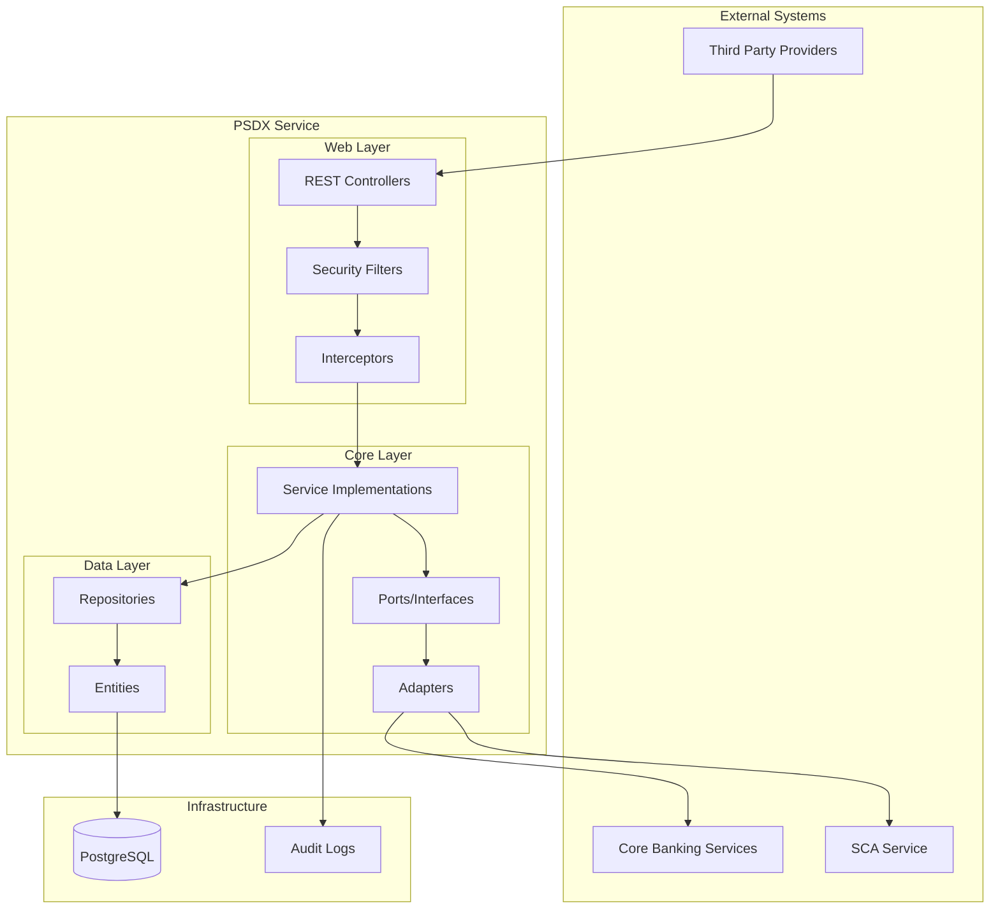
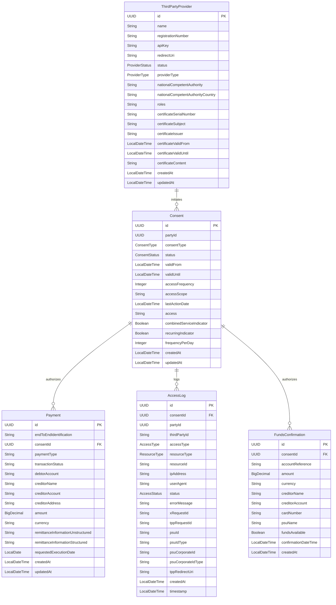

# Firefly Core Banking PSDX - PSD2/PSD3 Regulatory Compliance Service

[](LICENSE)
[](https://openjdk.org/projects/jdk/21/)
[](https://spring.io/projects/spring-boot)
[](https://docs.spring.io/spring-framework/docs/current/reference/html/web-reactive.html)

A comprehensive reactive microservice for PSD2/PSD3 and FIDA regulatory compliance in banking applications. This service provides a centralized point for handling open banking requirements, enabling secure third-party access to account information and payment services with explicit customer consent and strong authentication.

Part of the **Firefly OpenCore Banking Platform** developed by **Firefly Software Solutions Inc** under the Apache 2.0 license.

🌐 **Organization Website**: [getfirefly.io](https://getfirefly.io)
🐙 **GitHub Organization**: [firefly-oss](https://github.com/firefly-oss)

## Table of Contents

- [Overview](#overview)
- [Understanding PSD2, PSD3, and FIDA](#understanding-psd2-psd3-and-fida)
- [Key Features](#key-features)
- [Architecture](#architecture)
- [Project Structure](#project-structure)
- [Data Model](#data-model)
- [Installation](#installation)
- [Configuration](#configuration)
- [API Documentation](#api-documentation)
- [Security](#security)
- [Contributing](#contributing)
- [License](#license)

## Overview

The Firefly Core Banking PSDX service implements the requirements of the Payment Services Directive 2 (PSD2) and its evolution PSD3, along with Financial Data Access (FIDA) regulations. It enables banks to provide secure APIs for third-party providers (TPPs) to access customer account information and initiate payments, with explicit customer consent and strong authentication.

This service acts as a gateway between TPPs and the core banking systems, ensuring regulatory compliance while protecting customer data and providing a seamless integration experience for partners.

## Understanding PSD2, PSD3, and FIDA

### Payment Services Directive 2 (PSD2)
PSD2 is a European Union directive that came into effect in January 2018, designed to regulate payment services and payment service providers throughout the EU and EEA. The key objectives include:

- **Enhancing Consumer Protection**: Strengthening security requirements for electronic payments
- **Promoting Innovation**: Opening the banking sector to new players (Third Party Providers)
- **Improving Security**: Introducing Strong Customer Authentication (SCA) requirements
- **Reducing Costs**: Increasing competition in the payment services market

PSD2 introduced two new types of regulated service providers:
1. **Account Information Service Providers (AISPs)**: Access account information from multiple banks
2. **Payment Initiation Service Providers (PISPs)**: Initiate payments directly from customer accounts

### Payment Services Directive 3 (PSD3)
PSD3 is the anticipated evolution of PSD2, expected to focus on:

- **Enhanced API Standardization**: More standardized, feature-rich APIs
- **Expanded Scope**: Additional financial services and payment types
- **Improved User Experience**: Streamlined customer journeys
- **Premium API Services**: Value-added services beyond regulatory requirements
- **Global Interoperability**: Better alignment with open banking initiatives

### Financial Data Access (FIDA)
FIDA represents secure, consent-based access to financial data beyond PSD2 scope:

- **Comprehensive Data Access**: Investment accounts, loans, insurance, and other financial products
- **Global Approach**: Cross-jurisdictional financial data access
- **Consent Management**: Sophisticated mechanisms for data access control
- **Privacy by Design**: Built-in safeguards for sensitive financial information


## Key Features

### Core PSD2/PSD3 Services
- **🔐 Consent Management**: Complete lifecycle management of customer consents with granular permissions
- **🛡️ Strong Customer Authentication (SCA)**: Multi-factor authentication with SMS, app notifications, and biometrics
- **🏢 Third Party Provider (TPP) Management**: Registration, validation, and lifecycle management of TPPs
- **📊 Account Information Services (AIS)**: Secure access to account details, balances, and transaction history
- **💳 Payment Initiation Services (PIS)**: Secure payment initiation with real-time status tracking
- **💰 Funds Confirmation Services**: Real-time verification of fund availability
- **🃏 Card Account Services**: Support for card-based payment instruments and transactions

### Technical Features
- **⚡ Reactive Architecture**: Built with Spring WebFlux for high performance and non-blocking I/O
- **🔍 Comprehensive Audit Logging**: Complete access trails for regulatory compliance and monitoring
- **🔒 Enterprise Security**: Certificate validation, API key management, and encryption
- **📈 Scalable Design**: Microservice architecture with horizontal scaling capabilities
- **🌐 RESTful APIs**: OpenAPI 3.0 compliant with comprehensive documentation
- **🗄️ UUID-based Entities**: Modern UUID primary keys for better distributed system support

## Architecture

The Firefly Core Banking PSDX service follows a **hexagonal architecture** pattern with reactive programming principles:



### Key Architectural Components

- **🌐 Reactive Web Layer**: Spring WebFlux controllers with non-blocking I/O
- **🔧 Service Layer**: Business logic with hexagonal architecture ports and adapters
- **💾 Data Access Layer**: R2DBC for reactive database operations
- **🔒 Security Layer**: JWT authentication, API key validation, and consent management
- **📝 Audit Layer**: Comprehensive logging for regulatory compliance and monitoring

## Project Structure

The project follows a **multi-module Maven structure** with clear separation of concerns:

```
core-banking-psdx/
├── core-banking-psdx-interfaces/     # 📋 API contracts and DTOs
│   ├── dtos/                         # Data Transfer Objects
│   ├── enums/                        # Enumerations (ConsentType, ProviderStatus, etc.)
│   └── services/                     # Service interfaces
├── core-banking-psdx-models/         # 🗄️ Data models and repositories
│   ├── entities/                     # JPA entities with UUID primary keys
│   ├── repositories/                 # R2DBC reactive repositories
│   └── resources/db/migration/       # Flyway database migrations
├── core-banking-psdx-core/           # 🧠 Business logic and services
│   ├── services/                     # Service implementations
│   ├── ports/                        # Hexagonal architecture ports
│   ├── adapters/                     # External service adapters
│   └── mappers/                      # Entity-DTO mappers
├── core-banking-psdx-web/            # 🌐 Web layer and configuration
│   ├── controllers/                  # REST API controllers
│   ├── security/                     # Security configuration
│   ├── aspects/                      # AOP aspects for logging
│   └── interceptors/                 # Request/response interceptors
└── core-banking-psdx-sdk/            # 📚 Client SDK and OpenAPI spec
    └── resources/api-spec/           # OpenAPI 3.0 specification
```

### Module Dependencies
- **interfaces** ← **models** ← **core** ← **web**
- **sdk** contains the OpenAPI specification and client generation artifacts

## Data Model

The service uses **UUID-based entities** for better distributed system support and follows PSD2/PSD3 regulatory requirements:



### Entity Descriptions

- **ThirdPartyProvider**: Represents TPPs with certificate management and regulatory compliance data
- **Consent**: Customer consent with granular permissions and lifecycle management
- **Payment**: PSD2-compliant payment initiation with full transaction lifecycle
- **AccessLog**: Comprehensive audit trail for all API access and operations
- **FundsConfirmation**: Real-time funds availability verification for transactions

### Enumerations

- **ConsentType**: `ACCOUNT_INFORMATION`, `PAYMENT_INITIATION`, `FUNDS_CONFIRMATION`, `CARD_INFORMATION`
- **ConsentStatus**: `RECEIVED`, `VALID`, `REJECTED`, `REVOKED`, `EXPIRED`
- **ProviderType**: `AISP`, `PISP`, `CBPII`, `ASPSP`
- **ProviderStatus**: `ACTIVE`, `SUSPENDED`, `REVOKED`
- **AccessType**: `READ`, `WRITE`, `DELETE`
- **AccessStatus**: `SUCCESS`, `UNAUTHORIZED`, `FORBIDDEN`, `ERROR`
- **ResourceType**: `ACCOUNT`, `TRANSACTION`, `BALANCE`, `PAYMENT`, `CARD`, `CARD_TRANSACTION`, `CARD_BALANCE`, `FUNDS_CONFIRMATION`, `CONSENT`

## Installation

### Prerequisites

- **Java 21** or higher
- **Maven 3.8** or higher
- **PostgreSQL 14** or higher (with R2DBC support)
- **Docker** (optional, for containerized deployment)

### Quick Start

1. **Clone the repository**:
   ```bash
   git clone https://github.com/firefly-oss/core-banking-psdx.git
   cd core-banking-psdx
   ```

2. **Set up environment variables**:
   ```bash
   export DB_HOST=localhost
   export DB_PORT=5432
   export DB_NAME=psdx
   export DB_USERNAME=postgres
   export DB_PASSWORD=postgres
   export DB_SSL_MODE=disable
   ```

3. **Build and run**:
   ```bash
   mvn clean install
   java -jar core-banking-psdx-web/target/core-banking-psdx-web-1.0.0-SNAPSHOT.jar
   ```

4. **Verify installation**:
   ```bash
   curl http://localhost:8080/actuator/health
   ```

### Docker Deployment

```bash
# Build the application
mvn clean package

# Build Docker image
docker build -t firefly/core-banking-psdx .

# Run with Docker Compose
docker-compose up -d
```

## Configuration

The application uses **Spring Boot configuration** with environment-specific profiles:

### Core Configuration (`application.yaml`)

```yaml
spring:
  application:
    name: core-banking-psdx
    version: 1.0.0
    description: PSD2/PSD3 and FIDA Regulatory Compliance Service

  r2dbc:
    pool:
      initial-size: 5
      max-size: 10
      max-idle-time: 30m
      validation-query: SELECT 1
    url: r2dbc:postgresql://${DB_HOST}:${DB_PORT}/${DB_NAME}?sslMode=${DB_SSL_MODE}
    username: ${DB_USERNAME}
    password: ${DB_PASSWORD}

  flyway:
    enabled: true
    baseline-on-migrate: true
    locations: classpath:db/migration

server:
  port: ${SERVER_PORT:8080}
  shutdown: graceful

management:
  endpoints:
    web:
      exposure:
        include: health,info,metrics,prometheus
  endpoint:
    health:
      show-details: always
```

### PSD2/PSD3 Specific Configuration

```yaml
psdx:
  api:
    base-url: ${API_BASE_URL:http://localhost:8080}
  consent:
    default-expiry-days: 90
  security:
    token-validity-seconds: 3600
    jwt:
      secret: ${JWT_SECRET:ChangeThisToASecureSecretKeyInProduction}
    encryption:
      enabled: true
      algorithm: AES/GCM/NoPadding
  tpp:
    validation:
      enabled: true
      certificate-validation: true
  sca:
    required-for-all-payments: true
    exemption-threshold-amount: 30.00
    exemption-threshold-currency: EUR
```

## API Documentation

The service provides **comprehensive RESTful APIs** following PSD2/PSD3 standards with OpenAPI 3.0 specification.

### API Access

- **Swagger UI**: `http://localhost:8080/swagger-ui.html`
- **OpenAPI Spec**: `http://localhost:8080/v3/api-docs`
- **Health Check**: `http://localhost:8080/actuator/health`

### API Categories

| Category | Endpoint | Description |
|----------|----------|-------------|
| **TPP Management** | `/api/v1/providers` | Register and manage Third Party Providers |
| **Consent Management** | `/api/v1/consents` | Create and manage customer consents |
| **Account Information** | `/api/v1/accounts` | Access account details, balances, transactions |
| **Card Accounts** | `/api/v1/card-accounts` | Access card account information |
| **Payment Initiation** | `/api/v1/payments` | Initiate and manage payments |
| **Funds Confirmation** | `/api/v1/funds-confirmations` | Verify fund availability |
| **SCA** | `/api/v1/sca` | Strong Customer Authentication |
| **Access Logging** | `/api/v1/access-logs` | Audit trail and compliance logging |

### Authentication

The API uses **multiple authentication mechanisms**:

1. **API Key Authentication**
   ```bash
   curl -H "X-API-KEY: your-tpp-api-key" \
        http://localhost:8080/api/v1/providers/validate
   ```

2. **Consent-Based Authorization**
   ```bash
   curl -H "X-API-KEY: your-tpp-api-key" \
        -H "X-Consent-ID: consent-uuid" \
        http://localhost:8080/api/v1/accounts
   ```

3. **Strong Customer Authentication (SCA)**
   - Required for sensitive operations
   - Supports SMS, app notifications, and biometrics
   - Implements PSD2 exemption rules

### Quick API Examples

#### Register a TPP
```bash
curl -X POST http://localhost:8080/api/v1/providers \
  -H "Content-Type: application/json" \
  -d '{
    "name": "FinTech Solutions Ltd",
    "registrationNumber": "TPP123456",
    "nationalCompetentAuthority": "DE-BAFIN",
    "nationalCompetentAuthorityCountry": "DE",
    "redirectUri": "https://fintech-solutions.com/callback",
    "providerType": "AISP",
    "roles": ["PSP_AI", "PSP_PI"],
    "certificate": {
      "subject": "CN=FinTech Solutions Ltd,O=FinTech Solutions,C=DE",
      "issuer": "CN=PSD2 CA,O=European Banking Authority,C=EU",
      "serialNumber": "12345678",
      "content": "MIIEpAIBAAKCAQEA..."
    }
  }'
```

#### Create a Consent
```bash
curl -X POST http://localhost:8080/api/v1/consents \
  -H "Content-Type: application/json" \
  -H "X-API-KEY: your-api-key" \
  -d '{
    "partyId": "123e4567-e89b-12d3-a456-426614174000",
    "consentType": "account",
    "validUntil": "2024-12-31T23:59:59",
    "frequencyPerDay": 4,
    "access": [
      {
        "type": "account",
        "availableAccounts": "allAccounts"
      },
      {
        "type": "balance",
        "availableAccounts": "allAccounts"
      },
      {
        "type": "transaction",
        "availableAccounts": "allAccounts"
      }
    ]
  }'
```

#### Initiate a Payment
```bash
curl -X POST http://localhost:8080/api/v1/payments \
  -H "Content-Type: application/json" \
  -H "X-API-KEY: your-api-key" \
  -H "X-Consent-ID: 123e4567-e89b-12d3-a456-426614174001" \
  -d '{
    "paymentType": "sepa-credit-transfers",
    "endToEndIdentification": "E2E-ID-123",
    "debtorAccount": {
      "iban": "DE89370400440532013000",
      "currency": "EUR"
    },
    "creditorName": "John Doe",
    "creditorAccount": {
      "iban": "DE89370400440532013001",
      "currency": "EUR"
    },
    "instructedAmount": {
      "currency": "EUR",
      "amount": "100.00"
    },
    "remittanceInformationUnstructured": "Invoice payment #123"
  }'
```

#### Confirm Funds
```bash
curl -X POST http://localhost:8080/api/v1/funds-confirmations \
  -H "Content-Type: application/json" \
  -H "X-API-KEY: your-api-key" \
  -H "X-Consent-ID: 123e4567-e89b-12d3-a456-426614174002" \
  -d '{
    "account": {
      "iban": "DE89370400440532013000",
      "currency": "EUR"
    },
    "instructedAmount": {
      "currency": "EUR",
      "amount": "50.00"
    },
    "creditorName": "Merchant Ltd"
  }'
```

### Response Format

All responses follow **consistent JSON structure** with:
- **Standard HTTP status codes**: 200, 201, 400, 401, 403, 404, 500
- **HATEOAS links**: Navigation links in `_links` property
- **UUID identifiers**: All entity IDs are UUIDs
- **ISO standards**: Dates in ISO 8601, currencies in ISO 4217
- **Comprehensive error details**: Detailed error codes and messages
- **Pagination**: For collections with `page`, `size`, `totalElements`

#### Example Response Structure
```json
{
  "id": "123e4567-e89b-12d3-a456-426614174000",
  "name": "FinTech Solutions Ltd",
  "status": "ACTIVE",
  "createdAt": "2024-01-15T10:30:00",
  "_links": {
    "self": {"href": "/api/v1/providers/123e4567-e89b-12d3-a456-426614174000"},
    "activate": {"href": "/api/v1/providers/123e4567-e89b-12d3-a456-426614174000/activate"}
  }
}
```

#### Error Response Structure
```json
{
  "timestamp": "2024-01-15T10:30:00",
  "status": 400,
  "error": "Bad Request",
  "message": "Validation failed",
  "path": "/api/v1/consents",
  "details": [
    {
      "field": "partyId",
      "message": "Party ID must be a valid UUID"
    }
  ]
}
```

## Security

The service implements **enterprise-grade security** with multiple layers of protection:

### Authentication & Authorization
- **🔑 API Key Management**: Secure TPP identification and access control
- **🎫 JWT Tokens**: Stateless authentication with configurable expiration
- **✅ Consent Validation**: Granular permission checking for all data access
- **🔒 Certificate Validation**: X.509 certificate verification for TPPs
- **🛡️ Strong Customer Authentication (SCA)**: Multi-factor authentication compliance

### Data Protection
- **🔐 Encryption at Rest**: AES-256 encryption for sensitive data
- **🌐 TLS 1.3**: End-to-end encryption for all communications
- **🎭 Data Masking**: PII protection in logs and responses
- **🗑️ Data Minimization**: Only necessary data is collected and stored

### Compliance & Monitoring
- **📋 Comprehensive Audit Logging**: All API access tracked for regulatory compliance
- **🚨 Real-time Monitoring**: Suspicious activity detection and alerting
- **⏱️ Rate Limiting**: Protection against abuse and DoS attacks
- **🔍 Request Validation**: Input sanitization and validation

### Security Headers
```yaml
security:
  headers:
    frame-options: DENY
    content-type-options: nosniff
    xss-protection: "1; mode=block"
    strict-transport-security: "max-age=31536000; includeSubDomains"
```

### Environment Variables for Security
```bash
# JWT Configuration
JWT_SECRET=your-256-bit-secret-key
JWT_EXPIRATION=3600

# Database Security
DB_SSL_MODE=require
DB_PASSWORD=secure-password

# Encryption
ENCRYPTION_SECRET=your-encryption-key
ENCRYPTION_ALGORITHM=AES/GCM/NoPadding
```

## Contributing

We welcome contributions to the Firefly Core Banking PSDX service!

### Development Setup

1. **Fork and clone the repository**
   ```bash
   git clone https://github.com/your-username/core-banking-psdx.git
   cd core-banking-psdx
   ```

2. **Set up development environment**
   ```bash
   # Install Java 21
   # Install PostgreSQL 14+
   # Set environment variables
   cp .env.example .env
   ```

3. **Run tests**
   ```bash
   mvn clean test
   ```

4. **Start development server**
   ```bash
   mvn spring-boot:run -pl core-banking-psdx-web
   ```

### Contribution Guidelines

- **🔀 Create feature branches**: `git checkout -b feature/amazing-feature`
- **✅ Write tests**: Ensure good test coverage for new features
- **📝 Update documentation**: Keep README and API docs current
- **🎯 Follow code style**: Use the provided checkstyle configuration
- **📋 Create detailed PRs**: Include description, testing notes, and screenshots

### Code Standards

- **Java 21** features and best practices
- **Reactive programming** with Spring WebFlux
- **Comprehensive testing** with JUnit 5 and TestContainers
- **Clean architecture** with hexagonal pattern
- **OpenAPI 3.0** documentation for all endpoints

### Reporting Issues

Please use GitHub Issues to report bugs or request features:
- **🐛 Bug reports**: Include steps to reproduce, expected vs actual behavior
- **💡 Feature requests**: Describe the use case and proposed solution
- **🔒 Security issues**: Email security@getfirefly.io for sensitive issues

## License

This project is licensed under the **Apache License 2.0** - see the [LICENSE](LICENSE) file for details.

```
Copyright 2024 Firefly Software Solutions Inc

Licensed under the Apache License, Version 2.0 (the "License");
you may not use this file except in compliance with the License.
You may obtain a copy of the License at

    http://www.apache.org/licenses/LICENSE-2.0

Unless required by applicable law or agreed to in writing, software
distributed under the License is distributed on an "AS IS" BASIS,
WITHOUT WARRANTIES OR CONDITIONS OF ANY KIND, either express or implied.
See the License for the specific language governing permissions and
limitations under the License.
```

---

**Firefly OpenCore Banking Platform** - Building the future of open banking infrastructure.

🌐 **Website**: [getfirefly.io](https://getfirefly.io)
🐙 **GitHub**: [github.com/firefly-oss](https://github.com/firefly-oss)
📧 **Contact**: [dev@getfirefly.io](mailto:dev@getfirefly.io)
