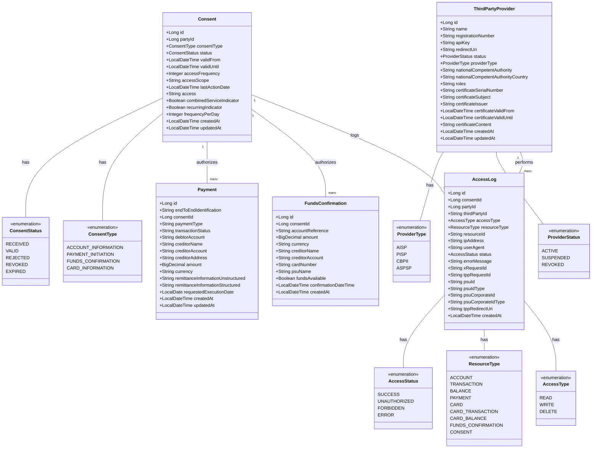

# Firefly Core Banking PSD X

[](https://opensource.org/licenses/Apache-2.0)

A comprehensive microservice for handling PSD2/PSD3 and FIDA regulatory requirements as part of the Firefly Core Banking Platform.

## Table of Contents

- [Overview](#overview)
- [Regulatory Framework](#regulatory-framework)
  - [PSD2 (Payment Services Directive 2)](#psd2-payment-services-directive-2)
  - [PSD3 (Payment Services Directive 3)](#psd3-payment-services-directive-3)
  - [FIDA (Financial Data Access)](#fida-financial-data-access)
  - [Compliance Implementation](#compliance-implementation)
- [Features](#features)
  - [Consent Management](#consent-management)
  - [Account Information Services (AIS)](#account-information-services-ais)
  - [Payment Initiation Services (PIS)](#payment-initiation-services-pis)
  - [Funds Confirmation Service (FCS)](#funds-confirmation-service-fcs)
  - [Third Party Provider Management](#third-party-provider-management)
  - [Access Logging](#access-logging)
  - [Strong Customer Authentication (SCA)](#strong-customer-authentication-sca)
- [Architecture](#architecture)
- [Data Model](#data-model)
- [API Documentation](#api-documentation)
- [Getting Started](#getting-started)
  - [Prerequisites](#prerequisites)
  - [Installation](#installation)
  - [Configuration](#configuration)
- [Usage Examples](#usage-examples)
  - [Consent Management](#consent-management-examples)
  - [Account Information Services](#account-information-services-examples)
  - [Payment Initiation Services](#payment-initiation-services-examples)
  - [Card Account Services](#card-account-services-examples)
  - [Funds Confirmation](#funds-confirmation-examples)
  - [Third Party Provider Management](#third-party-provider-management-examples)
  - [Access Logging](#access-logging-examples)
- [Integration with Other Microservices](#integration-with-other-microservices)
- [Security](#security)
- [Compliance](#compliance)
- [Contributing](#contributing)
- [License](#license)

## Overview

Firefly Core Banking PSD X is a centralized microservice for handling PSD2/PSD3 (Payment Services Directive) and FIDA (Financial Data Access) regulatory requirements. It provides a unified interface for Third Party Providers (TPPs) to access customer data and initiate payments, while ensuring compliance with regulatory standards.

The microservice is designed to integrate with other components of the Firefly Core Banking Platform, including:

- Core Banking Accounts
- Core Banking Cards
- Core Banking Payment Hub
- Core Banking Ledger
- Common Platform Customer Management
- Common Platform Contract Management
- Common Platform SCA Management

## Regulatory Framework

### PSD2 (Payment Services Directive 2)

PSD2 is a European Union directive (2015/2366) that came into effect in January 2018, designed to regulate payment services and payment service providers throughout the European Union and European Economic Area. The key objectives of PSD2 include:

- **Enhancing consumer protection** by implementing stronger security requirements for electronic payments
- **Promoting innovation and competition** in the financial services sector
- **Standardizing rights and obligations** for payment providers and users
- **Making payments safer and more secure** through Strong Customer Authentication (SCA)

PSD2 introduced two new types of regulated payment service providers:

1. **Account Information Service Providers (AISPs)**: Entities that can access account information from multiple banks on behalf of a customer
2. **Payment Initiation Service Providers (PISPs)**: Entities that can initiate payments on behalf of a customer

Additionally, PSD2 introduced the concept of **Card-Based Payment Instrument Issuers (CBPIIs)**, which can check the availability of funds in a customer's account before processing card payments.

### PSD3 (Payment Services Directive 3)

PSD3 is the upcoming revision of the Payment Services Directive, expected to be implemented in the coming years. While the final text is not yet available, PSD3 is anticipated to address gaps in PSD2 and further enhance the regulatory framework with:

- **Expanded scope** to cover new payment methods and technologies
- **Enhanced security requirements** to address emerging threats
- **Improved consumer protection** with clearer liability rules
- **Standardized API frameworks** to ensure better interoperability
- **Stronger enforcement mechanisms** to ensure compliance
- **Clearer rules for authentication exemptions** to improve user experience
- **Addressing challenges with Strong Customer Authentication (SCA)** implementation

### FIDA (Financial Data Access)

FIDA represents a broader global trend toward open banking and financial data sharing frameworks. While not a specific regulation like PSD2, FIDA encompasses various initiatives and regulations worldwide that aim to:

- **Standardize access to financial data** across institutions
- **Empower consumers** with control over their financial information
- **Foster innovation** in financial services through data sharing
- **Ensure secure and consent-based data access** for third parties
- **Promote competition** in the financial services sector

Examples of FIDA-related initiatives include the Consumer Data Right (CDR) in Australia, the Financial Data Exchange (FDX) in the US, and Open Banking initiatives in the UK, Brazil, and other countries.

### Compliance Implementation

Firefly Core Banking PSD X implements compliance with these regulatory frameworks through:

1. **Secure APIs**: RESTful APIs that follow industry standards for security and data protection
2. **Consent Management**: Comprehensive system for obtaining, tracking, and revoking customer consent
3. **Strong Customer Authentication**: Integration with SCA mechanisms to ensure secure access
4. **Access Control**: Role-based access control for TPPs based on their registered roles
5. **Audit Logging**: Detailed logging of all access to customer data for transparency and compliance
6. **TPP Verification**: Validation of TPP identities and credentials
7. **Standardized Data Formats**: Consistent data structures aligned with regulatory requirements

## Features

### Consent Management

- Creation, retrieval, and revocation of consents
- Support for different consent types (account information, payment initiation, funds confirmation, card information)
- Consent validation for specific operations
- Consent status tracking and management
- Time-limited and usage-limited consents
- Detailed consent audit trail

The consent management system is a cornerstone of PSD2/PSD3 and FIDA compliance, ensuring that TPPs can only access customer data with explicit permission. The service supports all consent types required by these regulations and provides comprehensive tracking of consent status and usage.

### Account Information Services (AIS)

- Retrieval of account details
- Retrieval of account balances
- Retrieval of account transactions
- Support for filtering and pagination
- Card account information access
- Card transaction history
- Transaction categorization
- Balance forecasting

The AIS functionality enables Account Information Service Providers (AISPs) to access customer account information in compliance with PSD2/PSD3 regulations. All access is consent-based and subject to Strong Customer Authentication, ensuring secure and authorized data sharing.

### Payment Initiation Services (PIS)

- Initiation of different payment types (SEPA, instant, international)
- Payment status tracking
- Payment cancellation
- Payment authorization
- Recurring payment support
- Batch payment processing
- Payment scheduling

The PIS functionality enables Payment Initiation Service Providers (PISPs) to initiate payments on behalf of customers in compliance with PSD2/PSD3 regulations. The service supports various payment types and provides comprehensive tracking and management of payment status.

### Funds Confirmation Service (FCS)

- Confirmation of funds availability
- Support for card-based payment instruments
- Real-time balance checking
- Pre-authorization support
- Reservation of funds

The FCS functionality enables Card-Based Payment Instrument Issuers (CBPIIs) to check the availability of funds in a customer's account before processing card payments, as required by PSD2/PSD3 regulations. This helps prevent declined transactions due to insufficient funds.

### Third Party Provider Management

- Registration and validation of TPPs
- TPP status management (active, suspended, revoked)
- API key management
- Role-based access control
- Certificate management
- TPP activity monitoring
- Regulatory reporting

The TPP management system ensures that only authorized and properly registered third-party providers can access the APIs, as required by PSD2/PSD3 and FIDA regulations. The service validates TPP identities and credentials and manages their access rights based on their registered roles.

### Access Logging

- Comprehensive logging of all access to customer data
- Audit trail for regulatory compliance
- Reporting capabilities for transparency
- Anomaly detection
- Real-time monitoring
- Retention policy management

The access logging system provides a detailed audit trail of all access to customer data, as required by PSD2/PSD3 and FIDA regulations. This ensures transparency and accountability and helps detect and prevent unauthorized access.

### Strong Customer Authentication (SCA)

- Integration with Common Platform SCA Management
- Support for different authentication methods
- Challenge-response flow
- SCA exemption handling
- Risk-based authentication
- Delegation of authentication
- Transaction signing

The SCA functionality ensures that all access to customer data and payment initiation is properly authenticated, as required by PSD2/PSD3 regulations. The service supports various authentication methods and handles exemptions based on regulatory criteria.

## Architecture

Firefly Core Banking PSD X follows a hexagonal architecture (ports and adapters) to ensure clean separation of concerns and maintainability:

- **Core Domain**: Contains the business logic and domain models
- **Ports**: Define interfaces for interacting with external systems
- **Adapters**: Implement the interfaces defined by the ports
- **Application Services**: Orchestrate the use cases
- **Web Layer**: Exposes the REST APIs

The hexagonal architecture provides several benefits for regulatory compliance:

1. **Separation of Concerns**: Business logic is isolated from external dependencies, making it easier to implement and update regulatory requirements without affecting other parts of the system.
2. **Testability**: Core business logic can be tested independently, ensuring that regulatory requirements are properly implemented and validated.
3. **Flexibility**: External systems can be replaced without affecting the core domain, allowing for easier integration with different banking systems and regulatory frameworks.
4. **Adaptability**: New regulatory requirements can be implemented with minimal changes to the existing codebase, making it easier to stay compliant with evolving regulations.

The microservice is built using:

- **Spring Boot and Spring WebFlux**: For reactive programming, providing high throughput and scalability for handling large volumes of API requests from TPPs.
- **R2DBC**: For reactive database access, ensuring efficient data retrieval and storage for consent management and access logging.
- **Flyway**: For database migrations, allowing for seamless schema updates as regulatory requirements evolve.
- **MapStruct**: For object mapping, ensuring consistent data transformation between different layers of the application.
- **Swagger/OpenAPI**: For API documentation, providing clear and comprehensive documentation for TPPs to integrate with the service.

The architecture is designed to be:

- **Scalable**: To handle increasing numbers of TPPs and API requests
- **Resilient**: To ensure high availability and fault tolerance
- **Secure**: To protect sensitive customer data and prevent unauthorized access
- **Compliant**: To meet all regulatory requirements for PSD2/PSD3 and FIDA
- **Maintainable**: To allow for easy updates and enhancements as regulations evolve

## Data Model



## API Documentation

The API is documented using Swagger/OpenAPI. When the service is running, you can access the API documentation at:

```
http://localhost:8080/swagger-ui.html
```

The API follows RESTful principles and is designed to comply with PSD2/PSD3 and FIDA requirements. All endpoints require appropriate authentication and authorization, and access to customer data is subject to valid consent.

### API Standards

- **RESTful Design**: Follows REST architectural principles
- **JSON Format**: All requests and responses use JSON format
- **HTTP Status Codes**: Standard HTTP status codes for responses
- **Hypermedia Links**: HATEOAS links for navigation
- **Pagination**: Support for paginated responses
- **Filtering**: Support for filtering data
- **Sorting**: Support for sorting data
- **Versioning**: API versioning for backward compatibility

### Required Headers

| Header | Description | Example | Regulatory Relevance |
|--------|-------------|---------|---------------------|
| `X-Request-ID` | Unique ID for the request | `99391c7e-ad88-49ec-a2ad-99ddcb1f7721` | Traceability for PSD2/PSD3 |
| `X-API-Key` | API key for TPP authentication | `api_key_12345` | TPP authentication for PSD2/PSD3 |
| `X-Consent-ID` | ID of the consent for the operation | `12345` | Consent validation for PSD2/PSD3 |
| `PSU-ID` | ID of the customer | `user@example.com` | Customer identification for PSD2/PSD3 |
| `PSU-IP-Address` | IP address of the customer | `192.168.1.1` | Fraud detection for PSD2/PSD3 |

### API Endpoints

#### Consent Management

| Method | Endpoint | Description | Request Body | Response | Regulatory Relevance |
|--------|----------|-------------|--------------|----------|---------------------|
| POST | `/api/consents` | Create a new consent | `PSDConsentRequestDTO` | `PSDConsentDTO` | PSD2/PSD3 consent requirement |
| GET | `/api/consents/{consentId}` | Get a consent by ID (Long consentId) | - | `PSDConsentDTO` | PSD2/PSD3 consent transparency |
| GET | `/api/consents?partyId={partyId}` | Get consents for a customer (Long partyId) | - | List of `PSDConsentDTO` | PSD2/PSD3 consent transparency |
| PUT | `/api/consents/{consentId}/status` | Update consent status (Long consentId) | `PSDConsentStatusDTO` | `PSDConsentDTO` | PSD2/PSD3 consent management |
| DELETE | `/api/consents/{consentId}` | Revoke a consent (Long consentId) | - | `PSDConsentDTO` | PSD2/PSD3 right to withdraw consent |

#### Account Information Services

| Method | Endpoint | Description | Request Header | Response | Regulatory Relevance |
|--------|----------|-------------|----------------|----------|---------------------|
| GET | `/api/accounts?partyId={partyId}` | Get accounts for a customer (Long partyId) | `X-Consent-ID` | List of `PSDAccountDTO` | PSD2/PSD3 AIS requirement |
| GET | `/api/accounts/{accountId}` | Get account details (Long accountId) | `X-Consent-ID` | `PSDAccountDTO` | PSD2/PSD3 AIS requirement |
| GET | `/api/accounts/{accountId}/balances` | Get account balances (Long accountId) | `X-Consent-ID` | List of `PSDBalanceDTO` | PSD2/PSD3 AIS requirement |
| GET | `/api/accounts/{accountId}/transactions` | Get account transactions (Long accountId) | `X-Consent-ID` | List of `PSDTransactionDTO` | PSD2/PSD3 AIS requirement |
| GET | `/api/accounts/{accountId}/transactions/{transactionId}` | Get transaction details (Long accountId, Long transactionId) | `X-Consent-ID` | `PSDTransactionDTO` | PSD2/PSD3 AIS requirement |

#### Card Account Services

| Method | Endpoint | Description | Request Header | Response | Regulatory Relevance |
|--------|----------|-------------|----------------|----------|---------------------|
| GET | `/api/card-accounts?partyId={partyId}` | Get card accounts for a customer (Long partyId) | `X-Consent-ID` | List of `PSDCardAccountDTO` | PSD2/PSD3 AIS requirement |
| GET | `/api/card-accounts/{cardId}` | Get card account details (Long cardId) | `X-Consent-ID` | `PSDCardAccountDTO` | PSD2/PSD3 AIS requirement |
| GET | `/api/card-accounts/{cardId}/balances` | Get card balances (Long cardId) | `X-Consent-ID` | List of `PSDBalanceDTO` | PSD2/PSD3 AIS requirement |
| GET | `/api/card-accounts/{cardId}/transactions` | Get card transactions (Long cardId) | `X-Consent-ID` | List of `PSDTransactionDTO` | PSD2/PSD3 AIS requirement |
| GET | `/api/card-accounts/{cardId}/transactions/{transactionId}` | Get card transaction details (Long cardId, Long transactionId) | `X-Consent-ID` | `PSDTransactionDTO` | PSD2/PSD3 AIS requirement |

#### Payment Initiation Services

| Method | Endpoint | Description | Request Header | Request Body | Response | Regulatory Relevance |
|--------|----------|-------------|----------------|--------------|----------|---------------------|
| POST | `/api/payments` | Initiate a payment | `X-Consent-ID` | `PSDPaymentInitiationRequestDTO` | `PSDPaymentDTO` | PSD2/PSD3 PIS requirement |
| GET | `/api/payments/{paymentId}` | Get payment details (Long paymentId) | `X-Consent-ID` | - | `PSDPaymentDTO` | PSD2/PSD3 PIS requirement |
| GET | `/api/payments/{paymentId}/status` | Get payment status (Long paymentId) | `X-Consent-ID` | - | `PSDPaymentStatusDTO` | PSD2/PSD3 PIS requirement |
| DELETE | `/api/payments/{paymentId}` | Cancel a payment (Long paymentId) | `X-Consent-ID` | - | `PSDPaymentDTO` | PSD2/PSD3 PIS requirement |
| POST | `/api/payments/{paymentId}/authorize` | Authorize a payment (Long paymentId) | `X-Consent-ID` | Authorization code | `PSDPaymentDTO` | PSD2/PSD3 SCA requirement |

#### Funds Confirmation Services

| Method | Endpoint | Description | Request Header | Request Body | Response | Regulatory Relevance |
|--------|----------|-------------|----------------|--------------|----------|---------------------|
| POST | `/api/funds-confirmations` | Confirm funds | `X-Consent-ID` | `PSDFundsConfirmationRequestDTO` | `PSDFundsConfirmationResponseDTO` | PSD2/PSD3 CBPII requirement |
| GET | `/api/funds-confirmations/{fundsConfirmationId}` | Get funds confirmation details (Long fundsConfirmationId) | `X-Consent-ID` | - | `PSDFundsConfirmationResponseDTO` | PSD2/PSD3 CBPII requirement |

#### Third Party Provider Management

| Method | Endpoint | Description | Request Body | Response | Regulatory Relevance |
|--------|----------|-------------|--------------|----------|---------------------|
| POST | `/api/providers` | Register a new provider | `PSDThirdPartyProviderRegistrationDTO` | `PSDThirdPartyProviderDTO` | PSD2/PSD3 TPP registration |
| GET | `/api/providers/{providerId}` | Get provider details (Long providerId) | - | `PSDThirdPartyProviderDTO` | PSD2/PSD3 TPP transparency |
| GET | `/api/providers` | Get all providers | - | List of `PSDThirdPartyProviderDTO` | PSD2/PSD3 TPP transparency |
| PUT | `/api/providers/{providerId}` | Update provider details (Long providerId) | `PSDThirdPartyProviderDTO` | `PSDThirdPartyProviderDTO` | PSD2/PSD3 TPP management |
| POST | `/api/providers/{providerId}/suspend` | Suspend a provider (Long providerId) | - | `PSDThirdPartyProviderDTO` | PSD2/PSD3 TPP management |
| POST | `/api/providers/{providerId}/activate` | Activate a provider (Long providerId) | - | `PSDThirdPartyProviderDTO` | PSD2/PSD3 TPP management |
| DELETE | `/api/providers/{providerId}` | Revoke a provider (Long providerId) | - | `PSDThirdPartyProviderDTO` | PSD2/PSD3 TPP management |
| POST | `/api/providers/validate` | Validate API key | Header: `X-API-KEY` | `PSDThirdPartyProviderDTO` | PSD2/PSD3 TPP authentication |

#### Access Logging

| Method | Endpoint | Description | Request Body | Response | Regulatory Relevance |
|--------|----------|-------------|--------------|----------|---------------------|
| POST | `/api/access-logs` | Log an access | `PSDAccessLogRequestDTO` | `PSDAccessLogDTO` | PSD2/PSD3 audit requirement |
| GET | `/api/access-logs/{logId}` | Get access log details (Long logId) | - | `PSDAccessLogDTO` | PSD2/PSD3 audit requirement |
| GET | `/api/access-logs?partyId={partyId}` | Get access logs for a customer (Long partyId) | - | List of `PSDAccessLogDTO` | PSD2/PSD3 transparency requirement |
| GET | `/api/access-logs/date-range` | Get access logs for a customer in date range | - | List of `PSDAccessLogDTO` | PSD2/PSD3 transparency requirement |
| GET | `/api/access-logs/consent/{consentId}` | Get access logs for a consent (Long consentId) | - | List of `PSDAccessLogDTO` | PSD2/PSD3 consent monitoring |
| GET | `/api/access-logs/third-party/{thirdPartyId}` | Get access logs for a third party | - | List of `PSDAccessLogDTO` | PSD2/PSD3 TPP monitoring |

## Getting Started

### Prerequisites

- Java 17 or higher
- Maven 3.6 or higher
- PostgreSQL 12 or higher

### Installation

1. Clone the repository:

```bash
git clone https://github.com/firefly/core-banking-psdx.git
cd core-banking-psdx
```

2. Build the project:

```bash
mvn clean install
```

3. Run the application:

```bash
java -jar core-banking-psdx-web/target/core-banking-psdx-web-1.0.0.jar
```

### Configuration

The application can be configured using the `application.yaml` file:

```yaml
spring:
  application:
    name: core-banking-psdx
    version: 1.0.0
    description: PSD2/PSD3 and FIDA Regulatory Compliance Service
  r2dbc:
    url: r2dbc:postgresql://${DB_HOST:localhost}:${DB_PORT:5432}/${DB_NAME:psdx_db}?sslMode=${DB_SSL_MODE:disable}
    username: ${DB_USERNAME:postgres}
    password: ${DB_PASSWORD:password}

integration:
  customer-mgmt:
    enabled: ${CUSTOMER_MGMT_ENABLED:false}
    base-url: "${CUSTOMER_MGMT_URL:http://common-platform-customer-mgmt:8080}"
  contract-mgmt:
    enabled: ${CONTRACT_MGMT_ENABLED:false}
    base-url: "${CONTRACT_MGMT_URL:http://common-platform-contract-mgmt:8080}"
  accounts:
    enabled: ${ACCOUNTS_ENABLED:false}
    base-url: "${ACCOUNTS_URL:http://core-banking-accounts:8080}"
  cards:
    enabled: ${CARDS_ENABLED:false}
    base-url: "${CARDS_URL:http://core-banking-cards:8080}"
  payment-hub:
    enabled: ${PAYMENT_HUB_ENABLED:false}
    base-url: "${PAYMENT_HUB_URL:http://core-banking-payment-hub:8080}"
  ledger:
    enabled: ${LEDGER_ENABLED:false}
    base-url: "${LEDGER_URL:http://core-banking-ledger:8080}"
  sca-mgmt:
    enabled: ${SCA_MGMT_ENABLED:false}
    base-url: "${SCA_MGMT_URL:http://common-platform-sca-mgmt:8080}"

psdx:
  consent:
    default-expiry-days: 90
  security:
    token-validity-seconds: 3600
    refresh-token-validity-days: 30
  tpp:
    validation:
      enabled: true
      certificate-validation: true
  logging:
    retention-days: 365
  sca:
    required-for-all-payments: true
    exemption-threshold-amount: 30.00
    exemption-threshold-currency: EUR
```

#### Configuration Properties

| Property | Description | Default | Regulatory Relevance |
|----------|-------------|---------|---------------------|
| `psdx.consent.default-expiry-days` | Default validity period for consents in days | 90 | PSD2/PSD3 requires time-limited consents |
| `psdx.security.token-validity-seconds` | Validity period for access tokens in seconds | 3600 | Security requirement for short-lived tokens |
| `psdx.security.refresh-token-validity-days` | Validity period for refresh tokens in days | 30 | Balance between security and user experience |
| `psdx.tpp.validation.enabled` | Enable TPP validation | true | PSD2/PSD3 requires TPP validation |
| `psdx.tpp.validation.certificate-validation` | Enable eIDAS certificate validation | true | PSD2/PSD3 requires certificate validation |
| `psdx.logging.retention-days` | Retention period for access logs in days | 365 | Regulatory requirement for audit trails |
| `psdx.sca.required-for-all-payments` | Require SCA for all payments | true | PSD2/PSD3 SCA requirement |
| `psdx.sca.exemption-threshold-amount` | Amount threshold for SCA exemption | 30.00 | PSD2/PSD3 allows exemptions for low-value payments |
| `psdx.sca.exemption-threshold-currency` | Currency for SCA exemption threshold | EUR | Currency context for exemption threshold |

## Usage Examples

### Consent Management Examples

#### Creating a Consent

```bash
curl -X POST http://localhost:8080/api/consents \
  -H "Content-Type: application/json" \
  -d '{
    "partyId": 123456,
    "consentType": "account",
    "validFrom": "2023-01-01T00:00:00",
    "validUntil": "2024-01-01T00:00:00",
    "frequencyPerDay": 4,
    "access": [
      {
        "type": "account",
        "accounts": [
          {
            "iban": "DE89370400440532013000"
          }
        ]
      },
      {
        "type": "balance",
        "accounts": [
          {
            "iban": "DE89370400440532013000"
          }
        ]
      }
    ],
    "recurringIndicator": true
  }'
```

#### Getting a Consent

```bash
curl -X GET http://localhost:8080/api/consents/12345  # Long consentId
```

#### Revoking a Consent

```bash
curl -X DELETE http://localhost:8080/api/consents/12345
```

### Account Information Services Examples

#### Getting Accounts

```bash
curl -X GET http://localhost:8080/api/accounts?partyId=123456 \
  -H "X-Consent-ID: 12345"
```

#### Getting Account Balances

```bash
curl -X GET http://localhost:8080/api/accounts/123456/balances \
  -H "X-Consent-ID: 12345"
```

#### Getting Account Transactions

```bash
curl -X GET "http://localhost:8080/api/accounts/123456/transactions?fromDate=2023-01-01&toDate=2023-12-31" \
  -H "X-Consent-ID: 12345"
```

### Payment Initiation Services Examples

#### Initiating a Payment

```bash
curl -X POST http://localhost:8080/api/payments \
  -H "Content-Type: application/json" \
  -H "X-Consent-ID: 12345" \
  -d '{
    "paymentType": "sepa-credit-transfers",
    "debtorAccount": {
      "iban": "DE89370400440532013000"
    },
    "creditorName": "John Doe",
    "creditorAccount": {
      "iban": "FR1420041010050500013M02606"
    },
    "instructedAmount": {
      "currency": "EUR",
      "amount": 123.50
    },
    "remittanceInformationUnstructured": "Invoice 123"
  }'
```

#### Getting Payment Status

```bash
curl -X GET http://localhost:8080/api/payments/123456/status \
  -H "X-Consent-ID: 12345"
```

#### Authorizing a Payment

```bash
curl -X POST http://localhost:8080/api/payments/123456/authorize \
  -H "X-Consent-ID: 12345" \
  -d "123456"
```

### Card Account Services Examples

#### Getting Card Accounts

```bash
curl -X GET http://localhost:8080/api/card-accounts?partyId=123456 \
  -H "X-Consent-ID: 12345"
```

#### Getting Card Balances

```bash
curl -X GET http://localhost:8080/api/card-accounts/123456/balances \
  -H "X-Consent-ID: 12345"
```

#### Getting Card Transactions

```bash
curl -X GET "http://localhost:8080/api/card-accounts/123456/transactions?fromDate=2023-01-01&toDate=2023-12-31" \
  -H "X-Consent-ID: 12345"
```

### Funds Confirmation Examples

#### Confirming Funds

```bash
curl -X POST http://localhost:8080/api/funds-confirmations \
  -H "Content-Type: application/json" \
  -H "X-Consent-ID: 12345" \
  -d '{
    "account": {
      "iban": "DE89370400440532013000"
    },
    "instructedAmount": {
      "currency": "EUR",
      "amount": 100.00
    }
  }'
```

#### Getting Funds Confirmation

```bash
curl -X GET http://localhost:8080/api/funds-confirmations/123456 \
  -H "X-Consent-ID: 12345"
```

### Third Party Provider Management Examples

#### Registering a Provider

```bash
curl -X POST http://localhost:8080/api/providers \
  -H "Content-Type: application/json" \
  -d '{
    "name": "FinTech Solutions Ltd",
    "registrationNumber": "TPP123456",
    "nationalCompetentAuthority": "DE-BAFIN",
    "nationalCompetentAuthorityCountry": "DE",
    "redirectUri": "https://fintech-solutions.com/callback",
    "providerType": "AISP",
    "roles": ["AISP", "PISP"]
  }'
```

#### Suspending a Provider

```bash
curl -X POST http://localhost:8080/api/providers/12345/suspend
```

### Access Logging Examples

#### Logging an Access

```bash
curl -X POST http://localhost:8080/api/access-logs \
  -H "Content-Type: application/json" \
  -d '{
    "consentId": 12345,
    "partyId": 123456,
    "thirdPartyId": "TPP123456",
    "accessType": "READ",
    "resourceType": "ACCOUNT",
    "resourceId": "ACC123456",
    "ipAddress": "192.168.1.1",
    "userAgent": "Mozilla/5.0",
    "status": "SUCCESS"
  }'
```

#### Getting Access Logs for a Customer

```bash
curl -X GET http://localhost:8080/api/access-logs?partyId=123456
```

## Integration with Other Microservices

Firefly Core Banking PSD X integrates with other microservices in the Firefly Core Banking Platform:

- **Core Banking Accounts**: For retrieving account information
- **Core Banking Cards**: For retrieving card account information
- **Core Banking Ledger**: For retrieving transaction information
- **Core Banking Payment Hub**: For initiating and managing payments
- **Common Platform Customer Management**: For customer information
- **Common Platform Contract Management**: For contract information
- **Common Platform SCA Management**: For strong customer authentication

The integration is implemented using a hexagonal architecture with ports and adapters, allowing for easy replacement of the underlying implementations.

## Security

Firefly Core Banking PSD X implements comprehensive security measures to comply with PSD2/PSD3 and FIDA requirements:

### Authentication and Authorization

- **API Key Authentication**: Secure authentication mechanism for TPPs using API keys
- **OAuth 2.0 / OpenID Connect**: Industry-standard protocol for authorization
- **JWT (JSON Web Tokens)**: Secure token format for authentication and authorization
- **Certificate-Based Authentication**: Validation of eIDAS certificates for TPP identity verification
- **Role-Based Access Control (RBAC)**: Granular access control based on TPP roles (AISP, PISP, CBPII)

### Strong Customer Authentication (SCA)

- **Multi-Factor Authentication**: Combination of knowledge, possession, and inherence factors
- **Dynamic Linking**: Binding authentication to specific transaction details
- **Challenge-Response Mechanisms**: Secure verification of customer identity
- **SCA Exemption Handling**: Risk-based approach for low-value or low-risk transactions
- **Delegation to SCA Management Service**: Integration with centralized authentication service

### Data Protection

- **TLS/SSL Encryption**: Secure communication between TPPs and the service
- **Data Encryption at Rest**: Protection of sensitive data in the database
- **Data Minimization**: Only necessary data is collected and processed
- **Secure Key Management**: Protection of cryptographic keys
- **Secure Coding Practices**: Prevention of common vulnerabilities (OWASP Top 10)

### Monitoring and Audit

- **Comprehensive Access Logging**: Detailed records of all access to customer data
- **Real-Time Monitoring**: Detection of suspicious activities
- **Anomaly Detection**: Identification of unusual patterns
- **Intrusion Detection**: Protection against attacks
- **Security Incident Response**: Procedures for handling security incidents

### Compliance with Security Standards

- **PSD2 RTS on SCA and CSC**: Regulatory Technical Standards on Strong Customer Authentication and Common and Secure Communication
- **OWASP ASVS**: Application Security Verification Standard
- **ISO 27001**: Information Security Management
- **NIST Cybersecurity Framework**: Best practices for managing cybersecurity risk

The security measures are continuously reviewed and updated to address emerging threats and comply with evolving regulatory requirements.

## Compliance

Firefly Core Banking PSD X is designed to comply with:

- **PSD2/PSD3**: Payment Services Directive
  - Strong Customer Authentication (SCA)
  - Secure Communication
  - TPP Registration and Validation
  - Consent Management
  - Access to Account Information
  - Payment Initiation
  - Funds Confirmation

- **FIDA**: Financial Data Access
  - Standardized APIs
  - Consent-Based Access
  - Data Minimization
  - Purpose Limitation
  - Audit Logging

- **GDPR**: General Data Protection Regulation
  - Data Subject Rights
  - Lawful Basis for Processing
  - Data Minimization
  - Storage Limitation
  - Integrity and Confidentiality

- **eIDAS**: Electronic Identification, Authentication and Trust Services
  - Qualified Electronic Signatures
  - Qualified Electronic Seals
  - Qualified Website Authentication Certificates

### PSD2/PSD3 Compliance Details

The service implements the following key requirements of PSD2/PSD3:

1. **XS2A (Access to Account) Interface**: Provides standardized APIs for TPPs to access customer account information and initiate payments.
2. **Strong Customer Authentication (SCA)**: Integrates with SCA mechanisms to ensure secure access to customer data and payment initiation.
3. **TPP Verification**: Validates TPP identities and credentials using eIDAS certificates and national competent authority registrations.
4. **Consent Management**: Implements comprehensive consent management for all types of access, including time and usage limitations.
5. **Access Logging**: Provides detailed audit trails of all access to customer data for transparency and compliance.
6. **Fraud Monitoring**: Implements fraud detection and prevention mechanisms for payment initiation.
7. **Secure Communication**: Uses TLS/SSL for secure communication between TPPs and the service.

### FIDA Compliance Details

The service implements the following key requirements of FIDA:

1. **Standardized APIs**: Provides consistent and well-documented APIs for accessing financial data.
2. **Consent Management**: Ensures that all access to customer data is based on explicit consent.
3. **Data Minimization**: Implements mechanisms to ensure that only necessary data is shared with TPPs.
4. **Purpose Limitation**: Ensures that data is only used for the purposes specified in the consent.
5. **Audit Logging**: Provides detailed audit trails of all access to customer data.
6. **Security Measures**: Implements comprehensive security measures to protect customer data.
7. **Customer Control**: Provides mechanisms for customers to view, manage, and revoke consents.

## Contributing

Contributions are welcome! Please feel free to submit a Pull Request.

## License

This project is licensed under the Apache License 2.0 - see the [LICENSE](LICENSE) file for details.
